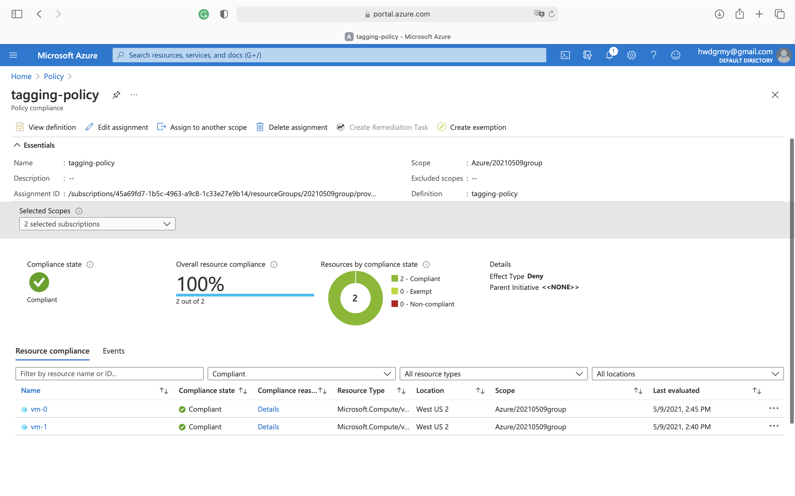
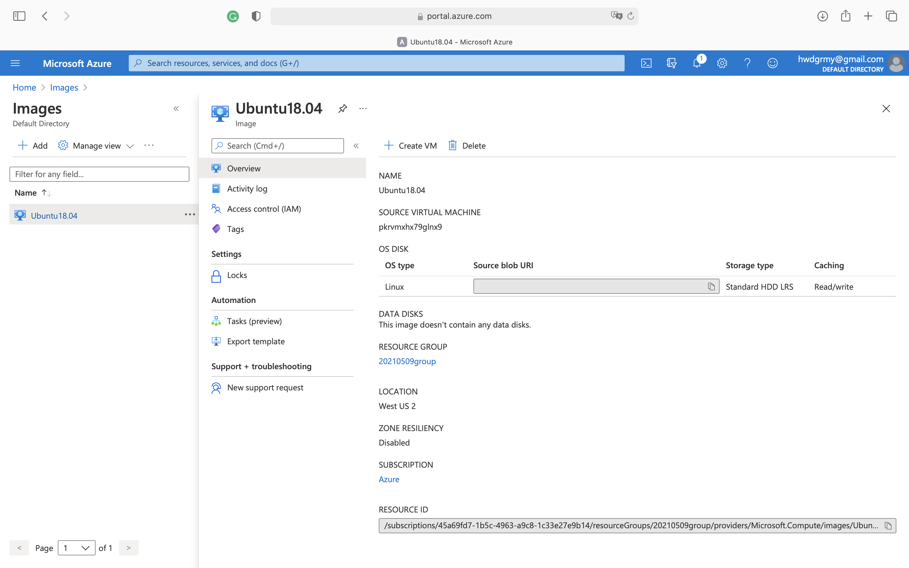
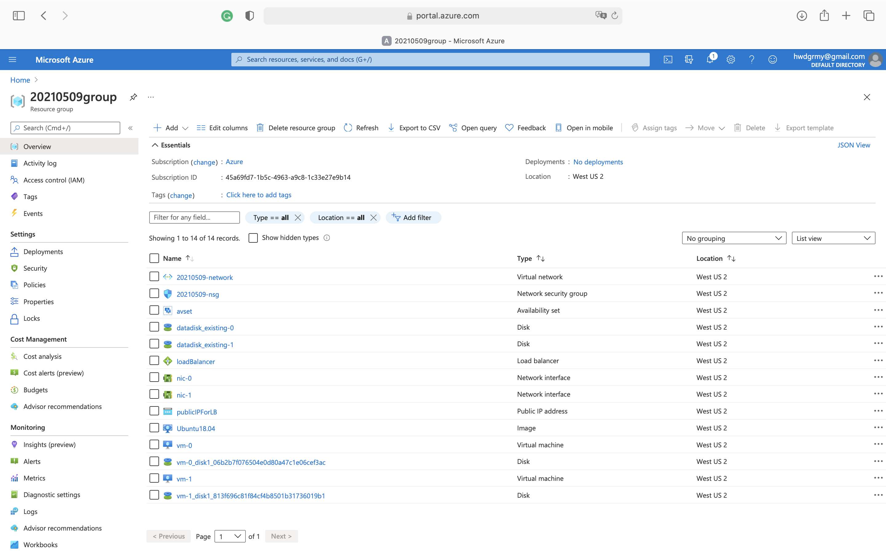

# Deploying a Scalable IaaS Web Server in Azure

## Introduction
Automated deployment and management of cloud infrastructure are crucial for ensuring the high uptimes that customers expect. In this project, I wrote infrastructure as code using Packer and Terraform to deploy a customizable, scalable web server in Azure. First, I created a policy that ensures all virtual machines are tagged. Second, I created and deployed a customized web server image with Packer. Lastly, I used Terraform to write the infrastructure configuration, which uses the customized image to create a set of load-balanced web servers. 

## Dependencies
1. Create an [Azure Account](https://portal.azure.com) 
2. Install the [Azure command line interface](https://docs.microsoft.com/en-us/cli/azure/install-azure-cli?view=azure-cli-latest)
3. Install [Packer](https://www.packer.io/downloads)
4. Install [Terraform](https://www.terraform.io/downloads.html)

## Instructions and Output
1. To create the policy and policy assignment, run the commands below. 
    ```
    az group create \
    --location westus2 \
    --name 20210509group

    az policy definition create \
    --name tagging-policy \
    --rules tagging-policy.json

    az policy assignment create \
    --policy tagging-policy \
    --display-name tagging-policy \
    --name tagging-policy \
    --resource-group 20210509group

    az policy assignment list -g 20210509group
    ```
    Check policy on the Azure Portal.
    
2. To deploy the packer image, retrieve `subscription_id`, `tenant_id`, `client_id`, and `client_secret`, and save them as environment variables.
    ```
    az account show --query "{ subscription_id: id }"
    az ad sp create-for-rbac --query "{ client_id: appId, client_secret: password, tenant_id: tenant }"
    ```
    Run the following command to deploy the image to Azure and view it.
    ```
    packer build server.json
    az image list
    ```
    Check the image on the Azure Portal.
    
3. To deploy the web server using Terraform, run the commands below. Edit the `var.tf` file to customize your deployment by updating the default values. 
    ```
    terraform init
    terraform fmt main.tf
    terraform fmt var.tf
    terraform plan -out vm.json
    terraform apply "vm.json"
    terraform show
    ```
    Check the resources on Azure Portal.
    