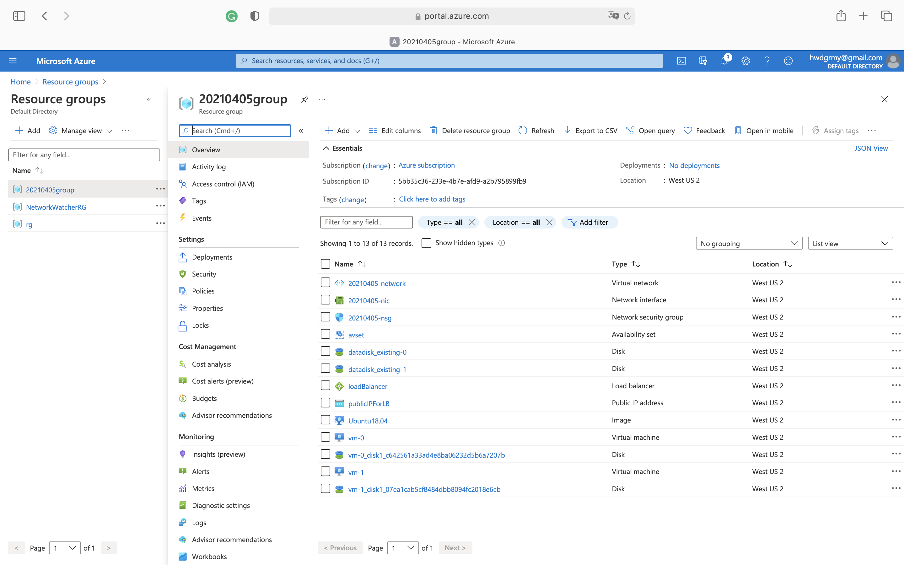

# Azure Infrastructure Operations Project: Deploying a scalable IaaS web server in Azure

## Introduction
In modern deployments, automated deployment and management of cloud infrastructure are crucial for ensuring the high uptimes that customers expect. In this project, I wrote infrastructure as code using Terraform and Packer to deploy a customizable, scalable web server in Azure. First, I created a policy that ensures all indexed resources are tagged. Second, I created and deployed a customized web server image with Packer. Lastly, I used Terraform to write the infrastructure configuration, which uses the customized image to create a set of load-balanced web servers. 

## Getting Started
1. Clone this repository
2. Create your infrastructure as code

## Dependencies
1. Create an [Azure Account](https://portal.azure.com) 
2. Install the [Azure command line interface](https://docs.microsoft.com/en-us/cli/azure/install-azure-cli?view=azure-cli-latest)
3. Install [Packer](https://www.packer.io/downloads)
4. Install [Terraform](https://www.terraform.io/downloads.html)

## Instructions and Output
1. To create the policy and policy assignment, run the commands below. The output should look like [policy_output.txt](https://github.com/iDataist/Deploy-a-Web-Server-in-Azure/blob/main/policy/policy_output.txt). 
    ```
    az group create \
    --location westus2 \
    --name rg

    az policy definition create \
    --name require-a-tag-on-vm \
    --rules tagging-policy.json

    az policy assignment create \
    --policy require-a-tag-on-vm \
    --display-name tagging-policy \
    --name tagging-policy \
    --resource-group rg

    az policy assignment list -g rg
    ```
    You can also check the policy compliance on the Azure portal.
    
2. To deploy the packer image, start by retrieving `subscription_id`, `tenant_id`, `client_id`, and `client_secret`, and save them as environment variables.
    ```
    az account show --query "{ subscription_id: id }"
    az ad sp create-for-rbac --query "{ client_id: appId, client_secret: password, tenant_id: tenant }"
    ```
    Then run the following command to deploy the image to Azure:
    ```
    packer build server.json
    ```
    The output should look like [packer_output.txt](https://github.com/iDataist/Deploy-a-Web-Server-in-Azure/blob/main/packer/packer_output.txt). 
    You can also view the image on the Azure portal.
    
3. To deploy the web server using Terraform, run the commands below. You can edit the `var.tf` file to customize your deployment by adding the default values. Or you can input the values of the variables when terraform asked for them.
    ```
    terraform init
    terraform plan -out vm.json
    terraform apply "vm.json"
    terraform show
    ```
    The output should look like [terraform_output.txt](https://github.com/iDataist/Deploy-a-Web-Server-in-Azure/blob/main/terraform/terraform_output.txt). 
    You can also view the resources on the Azure portal.
    